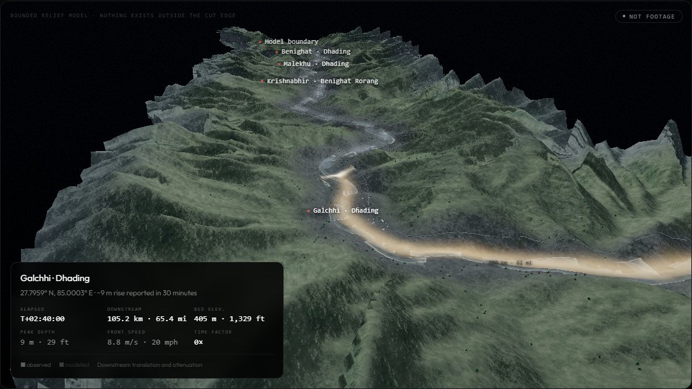

# Langtang–Trishuli · 26 August 2026

A labelled scientific reconstruction of the glacier collapse, debris dam, breach and downstream flood wave that struck the Nepal–Tibet border on 26 August 2026 — the reported toll, a bounded 3D model of the corridor built on a real elevation grid, and an analysis of what comes next for these valleys.

**This is a reconstruction, not a recreation of footage.** It shows no people, no bodies, and no moment of harm. Casualty figures appear once, each with its own source and date, and were still being revised when this was built.

---

## Screenshots

### Hero — the reported toll and the corridor map


### Where the flood went


### The 3D reconstruction, mid-corridor


### The border reach, close in


### The Dhading reach


### Analysis — what comes next


### Support — the official channel


### Mobile


---

## Key features

- **A real elevation grid, not a procedural mountain.** Terrain comes from a public-domain corridor-space grid (AWS Terrain Tiles, SRTM/ALOS-derived) covering **141.22 km · 87.75 mi** of channel — from the failure scar to Benighat in Dhading district — and 4.2 km · 2.6 mi either side, at roughly 92 m · 302 ft along the channel and 38 m · 125 ft across.
- **A traced channel, not a hand-drawn one.** The centreline was found by priority-flood depression filling and steepest-descent flow routing through that grid, starting from the failure scar. Checked independently against published coordinates: Rasuwagadhi 23 m, Syafrubesi 67 m, Betrawati 82 m, Devighat 127 m, Galchhi 645 m, Benighat 300 m.
- **A free-orbit 3D model in a box**, not a full-bleed canvas — drag to orbit, scroll to zoom toward the cursor, scrub the timeline in either direction with exact state restoration (nothing is baked forward-only).
- **A GPU flow solver** carrying depth, a sediment proxy and speed around timing anchored to the one sourced figure (the ~7-minute arrival at the border), with cross-channel superelevation on bends, run-up in constrictions, and backwater at the modelled blockage.
- **Every distance in both units.** Readouts, the scale bar, the corridor map ticks, the kilometre marks in the 3D scene and the sources panel all carry SI and US customary together — `124.6 km · 77.4 mi`, `353 m · 1,158 ft`, `8.8 m/s · 20 mph`.
- **The reported toll, sourced and dated**, shown once in the hero and nowhere inside the reconstruction.
- **A flat corridor map** marking settlements that lay in the flow path — explicitly *not* a per-place death count, because no village-by-village breakdown has been published.
- **A sources panel** inside the model listing every hard number on the page with where it came from, next to a list of what is modelled rather than measured.
- **A direct link to the official relief fund** — no payment QR, no code that could route money to the wrong place.
- **Runs smoothly while scrolling.** The render loop stops entirely when the model is off screen, so the rest of the page never fights it for frame time.

---

## Running it

This is a [Vite](https://vitejs.dev) project.

```bash
npm install
npm run dev       # dev server with hot reload
npm run build     # production build, output to dist/
npm run preview   # serve the production build locally
```

**Just want to look at it without installing anything?** Open **`standalone.html`** directly — double-click it. It's the same page with the source bundled into one file, using a pinned CDN build of three.js instead of the npm-resolved one. Regenerate it after editing `src/` with:

```bash
npm run standalone
```

Browsers block ES module imports from `file://` pages (CORS, origin `"null"`), so opening `index.html` itself by double-clicking will not work — it detects this and points you at `standalone.html` instead.

---

## Project layout

```
index.html              Vite entry point (markup only)
standalone.html         the same page, flattened — opens by double-clicking
build-standalone.cjs    regenerates standalone.html from src/
vite.config.js          base:'./' for relative deploys, e.g. GitHub Pages
package.json
src/
  util.js               helpers, the deterministic random stream
  state.js              playback + quality state, in one object
  data.js               sources, modelled assumptions, reported toll
  terrain-data.js        the embedded elevation grid (~272 KB base64)
  corridor.js            grid decode, traced channel, event timeline
  scene.js               renderer, the void, the sky probe
  terrain.js              the corridor block, its cut face and base
  flow.js                 collapse, debris dam, GPU flow solver
  water.js                flow surface, debris, spray
  overlays.js             built environment, flood band, peak extent, deposition
  controls.js             orbit camera and presets
  hud.js                  transport, readouts, labels, sources tables, audio
  site.js                 toll cards, flat corridor map, wireframe hero
  main.js                 post chain, wiring, frame loop, boot
  styles.css              all styling
docs/screenshots/        the images above
.verification/           automated test harness, QA captures, known limits
```

Module dependencies run one way: `util` and `state` depend on nothing; `corridor` builds on `terrain-data`; everything else builds on `corridor` and `scene`; `main` wires it together. There are no import cycles.

---

## What the model is, and is not

Timing is anchored to sourced figures at both ends of the reach. The traced chainage to the Rasuwagadhi confluence is 21.51 km · 13.4 mi, and setting the front to arrive there at the reported ~7 minutes gives 53.8 m/s · 120 mph — which independently reproduces the separately reported "first ~22 km at approximately 193 km/h". Downstream celerity used to be a free assumption; extending the model into Dhading brought a second sourced timing inside reach — Muglin is reported passed by 13:00 NPT — and 8.8 m/s · 20 mph is what puts the front there at that time. Peak stage is likewise anchored: its exponential decay is set by the reported ~9 m · 30 ft rise at Galchhi, which the model reproduces at that chainage.

Everything else is modelled and labelled as such, in the page's own sources panel and in `.verification/README.md`. The flow solver is a reduced GPU transport around prescribed hydrographs, **not** a conservative shallow-water model, and it cannot establish site-specific inundation. It should not be used for hazard planning or attribution.

## Two deliberate omissions

- **The map markers are not death counts.** No village-by-village casualty breakdown has been published; the finest published geography is district level. The markers show which settlements lay in the flow path, and the legend on the page says so.
- **There is no payment QR.** The support section links to the Government of Nepal's Prime Minister Disaster Relief Fund portal directly. A payment code that cannot be independently verified could send money to the wrong place.

## Verification

`node .verification/verify.cjs` starts the dev server, drives the page headlessly, and checks: zero console errors, the timeline round-trips exactly in both directions, superelevation reads correctly on the sharpest bends, and every camera preset and quality tier renders without breaking. `.verification/README.md` has the full report and the known limits of the reconstruction.

## Attribution

Terrain: AWS Terrain Tiles (public domain, SRTM/ALOS-derived). Rendering: [three.js](https://threejs.org). Every reported figure carries its own source in the page's Sources & uncertainty panel. This project is not affiliated with, endorsed by, or operated on behalf of the Government of Nepal or any other institution.
